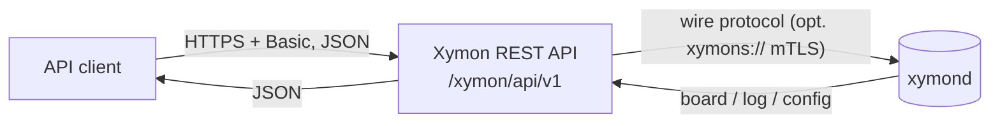
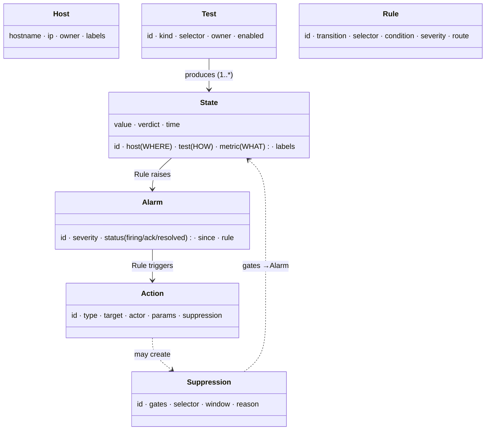

Xymon REST API — endpoint structure (visual)
============================================

Companion to `openapi.yaml` (the contract) and `01-MODEL.md` (the domain model).
At-a-glance map: the request flow, the two planes, every endpoint, the `/states`
query model, and the data model. Base path `/xymon/api/v1`; HTTP Basic on every
endpoint.


1. Request flow
---------------
The API is a thin translation over xymond; it holds no monitoring state itself.




2. Two planes, one server endpoint
-----------------------------------
```
/xymon/api/v1
├── GET  /health                                     server liveness

│  ── OBSERVED (read-only + the real writes) ──
├── /states           GET   query (filter by any dimension; `rollup` to aggregate)
│   │                 POST  ingest a batch of readings (combo)
│   └── /{id}         GET   one state
├── /alarms           GET   query conditions raised from state
│   └── /{id}         GET   one alarm
├── /actions          GET   the action log
│   │                 POST  issue a command (ack / disable / enable)
│   └── /{id}         GET   one action

│  ── DEFINED (config; uniform CRUD) ──
├── /hosts            GET POST   · /{id} GET PUT DELETE
├── /tests            GET POST   · /{id} GET PUT DELETE
├── /rules            GET POST   · /{id} GET PUT DELETE
└── /suppressions     GET POST   · /{id} GET PUT DELETE
```
**Defined** resources are read/write (config). **Observed** resources are
read-only, except the two real writes: ingest (`POST /states`) and operator
commands (`POST /actions`). Every config resource has the *identical* shape —
only its record schema differs.


3. Endpoint catalog
-------------------
| Plane | Path | Methods | Role / maps to |
|-------|------|---------|----------------|
| server   | `/health`            | GET                | liveness (`ping`) |
| observed | `/states`            | GET, POST          | query board / ingest (`xymondboard` / `status`+`combo`) |
| observed | `/states/{id}`       | GET                | one cell (`xymondlog`) |
| observed | `/alarms`            | GET                | raised conditions |
| observed | `/alarms/{id}`       | GET                | one alarm |
| observed | `/actions`           | GET, POST          | action log / **ack·disable·enable** command |
| observed | `/actions/{id}`      | GET                | one action |
| defined  | `/hosts`             | GET, POST          | hosts |
| defined  | `/hosts/{id}`        | GET, PUT, DELETE   | one host |
| defined  | `/tests`             | GET, POST          | check definitions |
| defined  | `/tests/{id}`        | GET, PUT, DELETE   | one test |
| defined  | `/rules`             | GET, POST          | State→Alarm / Alarm→Action rules |
| defined  | `/rules/{id}`        | GET, PUT, DELETE   | one rule |
| defined  | `/suppressions`      | GET, POST          | disable / maintenance / dependency |
| defined  | `/suppressions/{id}` | GET, PUT, DELETE   | one suppression (DELETE = "enable") |

ack/disable/enable are **not** endpoints — they are `POST /actions {type}`, and
an operator action may create a Suppression. "enable" = `DELETE` that suppression.


4. The `/states` query model
----------------------------
A State is a label-set; **every dimension is a filter**, and `rollup` turns the
flat states into the familiar aggregate "column color".

| Param      | Question | Example |
|------------|----------|---------|
| `host`     | WHERE (anchor)   | `host=web1` |
| `test`     | HOW (anchor)     | `test=disk` |
| `metric`   | WHAT             | `metric=pct_used` |
| `selector` | free WHERE dims  | `selector=mount=/var,core=3` |
| `verdict`  | the answer       | `verdict=red` |
| `rollup`   | aggregate (max severity) | `rollup=host,test` → column color |
| `fields`   | projection       | `fields=host,test,verdict` |
| `limit`    | cap              | `limit=500` |

```
"what's red on web1?"        GET /states?host=web1&verdict=red
"is disk filling anywhere?"  GET /states?test=disk&metric=pct_used&verdict=red
"web1's disk column color?"  GET /states?host=web1&test=disk&rollup=host,test
"ack an alarm"               POST /actions {type:ack, target:{alarm:"web1:disk:/var"}, duration:"2h"}
"silence web1 tonight"       POST /suppressions {gates:stateToAlarm, selector:{host:web1}, window:{…}}
```


5. Data model
-------------

Relationships in words: a Test produces many States (one per item/metric); a
Rule raises an Alarm from State (+severity); a Rule routes an Alarm to an Action;
an operator Action may create a Suppression; a Suppression gates a transition.


6. Value references
-------------------
```
Color   (verdict)   green | yellow | red | blue | clear | purple
Severity            info | minor | major | critical
AlarmStatus         firing | acknowledged | resolved
ActionType          notify | ack | disable | enable
Duration            <number>[smhdw] | -1            e.g. 60m, 2h, -1

Status codes  200 OK · 201 Created · 202 Accepted · 204 No Content ·
              400 · 401 · 403 · 404 · 409 · 502 (xymond unreachable)
```


7. How it maps to the model
---------------------------
Straight off `01-MODEL.md`: the pipeline `Host → Test → State → Alarm → Action`
governed by "advance if a Rule matches, unless a Suppression holds". Defined
resources are the left side you configure; Observed resources are the runtime
you read; the value+verdict of a State is the answer its label dimensions key to.
