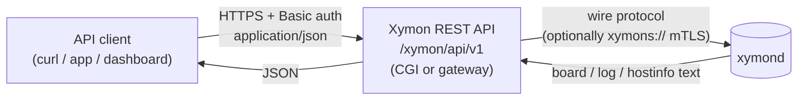
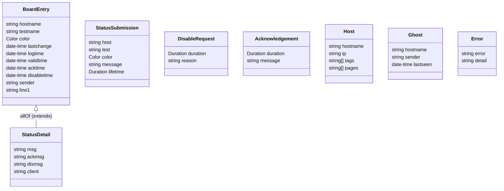

Xymon REST API — endpoint structure (visual)
============================================

Companion to `openapi.yaml` (the authoritative contract) and `00-DESIGN.md`
(rationale). This document is the at-a-glance map: the request flow, the
resource tree, every endpoint, and the data model. Base path: `/xymon/api/v1`.
Auth: HTTP Basic on every endpoint.


1. Request flow
---------------
The API is a thin translation layer; it holds no monitoring state of its own —
each call becomes one xymond wire-protocol request.



ASCII:

```
client ──HTTPS+Basic, JSON──▶ REST API ──wire verb (opt. mTLS)──▶ xymond
client ◀──────── JSON ─────── REST API ◀──── text response ────── xymond
```


2. Resource tree
----------------
```
/xymon/api/v1
├── GET   /ping                              health
├── GET   /board                             list status cells
├── POST  /status                            submit a status
├── /hosts
│   └── /{host}
│       ├── GET   .                          host info
│       └── /tests/{test}
│           ├── GET   .                      one status cell (full detail)
│           ├── POST  /disable               silence a test for a duration
│           ├── POST  /enable                un-silence a test
│           └── POST  /ack                   acknowledge a non-green status
├── GET   /ghosts                            unknown reporters
└── GET   /config/{file}                     fetch an (allow-listed) config file
```


3. Endpoint catalog
-------------------
| Method & path                               | Wire verb     | Request body        | Success | Error codes              |
|---------------------------------------------|---------------|---------------------|---------|--------------------------|
| `GET  /ping`                                | `ping`        | —                   | 200 `Pong` | 401, 502, 504         |
| `GET  /board`                               | `xymondboard` | — (query filters)   | 200 `{items:[BoardEntry]}` | 400, 401, 502, 504 |
| `POST /status`                              | `status`      | `StatusSubmission`  | 202     | 400, 401, 403, 502       |
| `GET  /hosts/{host}`                        | `hostinfo`    | —                   | 200 `Host` | 401, 404, 502         |
| `GET  /hosts/{host}/tests/{test}`           | `xymondlog`   | —                   | 200 `StatusDetail` | 401, 404, 502 |
| `POST /hosts/{host}/tests/{test}/disable`   | `disable`     | `DisableRequest`    | 202     | 400, 401, 404, 502       |
| `POST /hosts/{host}/tests/{test}/enable`    | `enable`      | —                   | 202     | 401, 404, 502            |
| `POST /hosts/{host}/tests/{test}/ack`       | `ack`         | `Acknowledgement`   | 201     | 400, 401, 404, 409, 502  |
| `GET  /ghosts`                              | `ghostlist`   | —                   | 200 `[Ghost]` | 401, 502           |
| `GET  /config/{file}`                       | `config`      | —                   | 200 `text/plain` | 401, 403, 404, 502 |

Reads are GET (safe, idempotent); state changes are POST. `/status` is an
idempotent upsert of one (host, test) cell.


4. Query parameters — `GET /board`
-----------------------------------
| Param   | Type    | Purpose                                  |
|---------|---------|------------------------------------------|
| `host`  | string  | filter by host name                      |
| `test`  | string  | filter by test/column name               |
| `color` | enum    | filter by status color                   |
| `page`  | string  | filter by Xymon page/path                |
| `tag`   | string  | filter by host tag                       |
| `limit` | integer | cap result count (1–10000, default 1000) |

(Filters map to xymondboard's native criteria. No cursor paging in v1 — narrow
with filters; revisit if needed.)


5. Data model
-------------


Relationships in words:
- `StatusDetail` = `BoardEntry` + the message fields (`msg`, `ackmsg`, `dismsg`,
  `client`). `GET /board` returns the lean `BoardEntry`; the single-cell
  `GET .../tests/{test}` returns the full `StatusDetail`.
- `StatusSubmission` / `DisableRequest` / `Acknowledgement` are the three write
  bodies. The latter two share the `Duration` value type.
- `Error` is the single error shape for every non-2xx (the HTTP status says
  which kind).


6. Value references
-------------------
```
Color     : green | yellow | red | blue | clear | purple
Duration  : <number>[s|m|h|d|w]   or   -1  (until OK)     e.g. 30m, 2h, -1
Timestamps: RFC 3339 in JSON (the API converts xymond's epoch seconds)
```

Status codes used across the API:

```
2xx  200 OK · 201 Created (ack) · 202 Accepted (writes; xymond is fire-and-forget)
4xx  400 bad request · 401 unauthenticated · 403 forbidden ·
     404 unknown host/test · 409 conflict (e.g. ack of a green status)
5xx  502 xymond unreachable · 504 xymond timeout
```


7. Where this maps in Xymon
---------------------------
Every endpoint is an existing xymond verb (see the catalog's "Wire verb"
column). Precedent for a machine-readable feed already exists in
`web/appfeed.c` (XML over `xymondboard`); this API generalizes that idea to a
documented JSON contract. Nothing here invents monitoring behavior.
